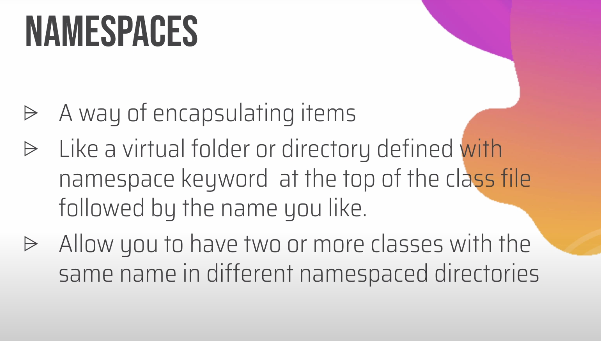
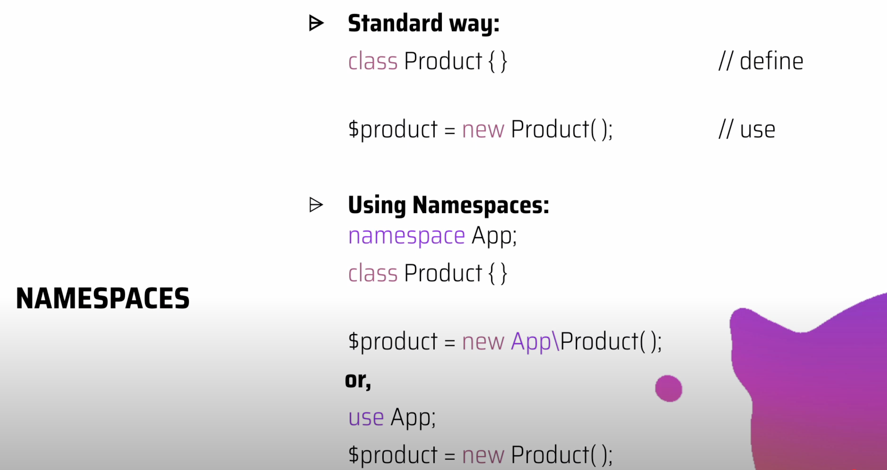
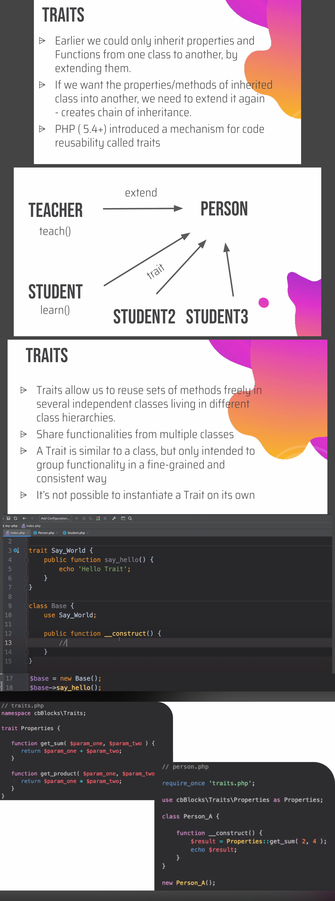
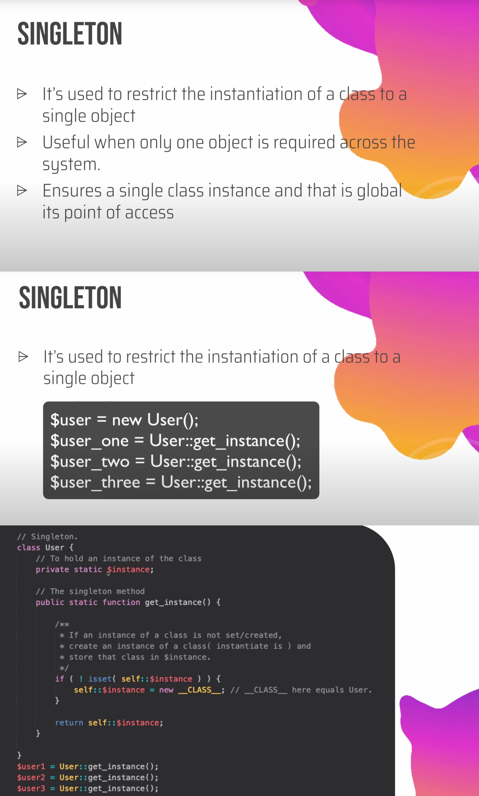

# Namespaces, `spl_autoloader`, Traits, PHP Singleton

---

## 📌 Namespaces

### **What is a Namespace?**

A **namespace** is a way to **group related classes, functions, and constants** together and **avoid name conflicts** in large PHP projects.
Think of it like a **folder for your PHP code**.




### **Purpose**

- Prevent name collisions between classes or functions.
- Organize code logically (like directories).
- Enable autoloading and cleaner project structure.

### **Core Syntax**

```php
namespace MyApp\Utils;

class Helper {
    public static function sayHello() {
        echo "Hello!";
    }
}
```

To use:

```php
use MyApp\Utils\Helper;
Helper::sayHello();
```

Or directly:

```php
MyApp\Utils\Helper::sayHello();
```

### **Key Points**

1. **Declared at the top** of the file, before any other code.
2. You can define **sub-namespaces** using backslashes (`\`).
3. The **global namespace** is the default (if no namespace is declared).
4. **`use` keyword** imports namespaces or aliases them.

   ```php
   use MyApp\Utils\Helper as H;
   H::sayHello();
   ```

5. Works great with **autoloading (PSR-4)** and **composer-based** structures.

### **Benefits**

✅ Prevents naming conflicts
✅ Improves code organization
✅ Supports autoloading & modular architecture
✅ Keeps large applications clean and scalable

### **In WordPress Context**

While WordPress core itself doesn’t use namespaces much (for backward compatibility), **modern plugins and themes** do:

```php
namespace PixelsLand\Admin;

class Menu {
    public function init() { /* ... */ }
}
```

This keeps your classes isolated from others like `Menu` classes from different plugins.

### 🧠 **Quick Cheat-Sheet**

| Concept               | Example                                |
| --------------------- | -------------------------------------- |
| Define namespace      | `namespace App\Controllers;`           |
| Use another namespace | `use App\Models\User;`                 |
| Alias name            | `use App\Models\User as UserModel;`    |
| Global namespace      | `\strlen()` (global function)          |
| Multiple namespaces   | Not recommended in one file            |
| Combine with autoload | PSR-4 standard uses folder = namespace |

### Why namespaces matter in WordPress themes

- Avoid collisions with plugins and core which live in the global namespace
- Organize theme logic by domain: Services, Assets, Blocks, REST, Customizer, Admin
- Enable PSR-4 autoloading and clean OOP without giant function prefixes
- Make testable modules that are easy to move between projects

### Core concepts you must know

#### 1) Declaring and importing

- `namespace` must be the first statement in a file
- One namespace per file is the usual practice
- Import with `use` and optional aliasing

```php
<?php
namespace MyTheme\Blocks;

use MyTheme\Support\Assets;
use Vendor\Lib\Client as ApiClient;
```

Group imports:

```php
use MyTheme\{Support\Assets, Support\Dates};
```

### Gotchas and best practices

- Do not mix multiple namespaces in one file unless you really must
- Place `namespace ...;` as the first statement
- Avoid global helper functions - prefer static class methods or dedicated utility classes
- Use `__NAMESPACE__ . '\\function'` when registering callbacks from the same file
- Prefer `ClassName::class` over hard coded strings
- Keep template files mostly presentational - put logic in namespaced classes
- Be careful with `require` paths - use WordPress helpers like `get_template_directory()`
- Avoid side effects on file load - register hooks in a boot method

---

---

---

---

## 📌 `spl_autoload_register()`

### **What It Is**

`spl_autoload_register()` is a **built-in PHP function** that **automatically loads classes or interfaces** when they are first used - so you **don’t need to manually `require` or `include`** files.

`spl_autoload_register` tells PHP how to **find and include class files on demand**. When your code first uses `new MyClass()`, PHP asks your autoloader: “where is the file for this class?”. Your autoloader maps the class name to a file path and `require`s it. No more dozens of `require_once` lines.

Why it exists:

- Avoid manual `require` spaghetti
- Faster dev and fewer bugs from missing includes
- Enables modern architecture with namespaces and folders

### How autoloading works in 3 steps

1. PHP sees a **class/interface/trait** name it does not know.
2. It runs your registered autoloader callbacks **in order**.
3. The first autoloader that can map the name to a file **includes** it.

Key terms:

- **Autoload stack:** multiple autoloaders can be registered. Order matters.
- **PSR-4 mapping:** standard that maps namespaces to directories.
- **Classmap:** array that maps class names to exact files.
- **Composer autoloader:** a generated autoloader that supports PSR-4, classmap, and files.


### Core function signature

```php
spl_autoload_register(
    callable $autoload,
    bool $throw = true,
    bool $prepend = false
);
```

- `$autoload`: your function that receives the class name.
- `$throw`: throw if registration fails.
- `$prepend`: put your autoloader at the **front** of the stack.

Helpers:

```php
spl_autoload_functions();  // list autoloaders
spl_autoload_unregister($callable); // remove one
```

Deprecated:

- `__autoload()` is deprecated. Use SPL autoloaders instead.

### Practical WP use cases

1. **Plugin architecture** - split code by domain.
2. **MU-plugins or custom platform**
   Register a global autoloader in `mu-plugins/autoload.php` and add multiple prefixes
3. **Legacy theme without Composer**
   Add a small autoloader in `functions.php` for your theme namespace
4. **Classmap for non-standard names**
   When file names do not match class names, keep a manual map.

**What problem does autoloading solve?**
It removes manual `require` lines and ensures the correct file is included exactly when the class is needed. This reduces boilerplate, avoids duplicate includes, and keeps architecture modular.

### **Purpose**

- To **automate class loading**.
- To **organize code** and **avoid dozens of includes**.
- To **support OOP + namespaces + PSR-4** structure.

### **Basic Syntax**

```php
spl_autoload_register(function($class) {
    include 'classes/' . $class . '.php';
});
```

Now when you call:

```php
$obj = new User();  // Automatically loads classes/User.php
```

### **Core Concepts**

1. **Autoloading triggers automatically** when PHP encounters an undefined class.
2. You can register **multiple autoloaders**.
3. **The callback receives the class name** (with namespace if used).
4. It’s often used in **composer-based** or **custom autoloaders**.

### **Example with Namespaces**

```php
spl_autoload_register(function($class) {
    $path = str_replace('\\', '/', $class) . '.php';
    require_once __DIR__ . '/src/' . $path;
});
```

So `App\Models\User` → `/src/App/Models/User.php`

### **Benefits**

✅ No need to manually `require_once` files
✅ Cleaner, scalable codebase
✅ Works seamlessly with namespaces
✅ Multiple autoloaders can coexist

### **In WordPress Context**

Used in **modern plugin/theme architectures**:

```php
spl_autoload_register(function ($class) {
    if (strpos($class, 'PixelsLand\\') !== false) {
        $path = __DIR__ . '/includes/' . str_replace('\\', '/', $class) . '.php';
        require_once $path;
    }
});
```

This autoloads classes like `PixelsLand\Admin\Menu` automatically.

### 🧠 **Quick Cheat-Sheet**

| Concept              | Example                                             |
| -------------------- | --------------------------------------------------- |
| Basic use            | `spl_autoload_register(fn($c)=>include $c.'.php');` |
| With namespace       | Replace `\\` with `/` in path                       |
| Multiple autoloaders | Call `spl_autoload_register()` multiple times       |
| Remove autoloader    | `spl_autoload_unregister($callback);`               |
| Common use           | In frameworks, Composer, plugins                    |

### Short summary

Autoloading loads class files automatically when first used. `spl_autoload_register` lets you define the mapping rule from class name to file path. In WordPress, combine namespaces + PSR-4 + Composer for clean structure and fewer includes. Keep the autoloader small, fast, and scoped to your prefix.

---

---

---

---

## 📌 Traits



A **Trait** is a mechanism in PHP that allows you to **reuse sets of methods** in multiple classes **without using inheritance**.
Think of it as a **code-sharing tool** for classes.

### **Purpose**

- To **avoid code duplication**.
- To **combine methods** from multiple sources.
- To **overcome single inheritance** limitation in PHP.

### **Core Concepts**

1. **Declared with `trait` keyword**

   ```php
   trait Logger {
       public function log($msg) {
           echo "Log: $msg";
       }
   }
   ```

2. **Used inside classes with `use`**

   ```php
   class FileHandler {
       use Logger;
   }
   ```

3. **Traits can have:**

   - Methods
   - Properties
   - Abstract methods
   - Static methods

4. **Conflict resolution**

   - If two traits have methods with the same name → use `insteadof` and `as` to resolve.

   ```php
   trait A { function talk() { echo "A"; } }
   trait B { function talk() { echo "B"; } }

   class MyClass {
       use A, B {
           A::talk insteadof B;
           B::talk as talkFromB;
       }
   }
   ```

### **Benefits**

✅ Code reuse without inheritance
✅ Cleaner and modular structure
✅ Works across unrelated classes

### **Limitations**

⚠️ Cannot be instantiated
⚠️ No constructor overriding
⚠️ Not a replacement for full inheritance

### **In WordPress**

Traits are often used in **plugins/themes** to share logic across multiple classes, for example:

- Logging utilities
- REST response formatting
- Common validation methods

```php
trait Singleton {
    private static $instance;
    public static function get_instance() {
        if (!self::$instance) self::$instance = new self();
        return self::$instance;
    }
}
```

### 🧠 **Quick Cheat-Sheet**

| Concept              | Syntax / Description                       |
| -------------------- | ------------------------------------------ |
| Declare a trait      | `trait Name {}`                            |
| Use in class         | `use TraitName;`                           |
| Conflict resolution  | `A::method insteadof B;`                   |
| Alias a method       | `B::method as newName;`                    |
| Traits + inheritance | Possible; traits applied after inheritance |
| Multiple traits      | `use T1, T2;`                              |

---

---

---

---

## 📌 Singleton design pattern



A **Singleton** is a design pattern that **allows only one instance of a class** to exist in the entire application.
It’s like having **one global object** that everyone shares and uses.

### **Purpose**

- To **restrict class instantiation** to a single object.
- To **save memory and resources**.
- To **provide one global access point** for that object.

### **When to Use**

- When you need **only one shared resource**, like:

  - Database connection
  - Logger
  - Configuration manager
  - Cache handler

### **Basic Example**

```php
class User {
    // Step 1: Hold single instance
    private static $instance;

    // Step 2: Prevent direct creation
    private function __construct() {}

    // Step 3: Provide a global access point
    public static function get_instance() {
        if (!isset(self::$instance)) {
            self::$instance = new self();
        }
        return self::$instance;
    }
}

// Usage
$user1 = User::get_instance();
$user2 = User::get_instance();

var_dump($user1 === $user2); // true ✅
```

### **Core Concepts**

| Concept                 | Description                                    |
| ----------------------- | ---------------------------------------------- |
| **Private constructor** | Prevents creating new instances using `new`    |
| **Static property**     | Stores the single instance                     |
| **Static method**       | Returns the same instance each time            |
| **Global access**       | Access it anywhere via `Class::get_instance()` |

### **In WordPress**

Used widely in **plugins and themes** to keep only one version of a class active:

```php
class PixelsLand {
    private static $instance;
    private function __construct() {}
    public static function get_instance() {
        return self::$instance ??= new self();
    }
}
PixelsLand::get_instance();
```

This ensures that your plugin logic runs only once.

### **Advantages**

✅ Saves memory and ensures consistent behavior
✅ Easy global access to shared resources
✅ Prevents accidental multiple object creation

### **Disadvantages**

⚠️ Harder to test (tight coupling)
⚠️ Hidden dependencies if misused
⚠️ May cause issues in multi-threaded contexts (not typical in PHP though)

### 🧠 **Quick Cheat-Sheet**

| Step                                        | What it does                                            |
| ------------------------------------------- | ------------------------------------------------------- |
| `private static $instance;`                 | Stores single instance                                  |
| `private function __construct()`            | Blocks `new` keyword                                    |
| `public static function get_instance()`     | Returns or creates the single instance                  |
| `private function __clone()` & `__wakeup()` | Prevents cloning/unserializing (optional best practice) |
